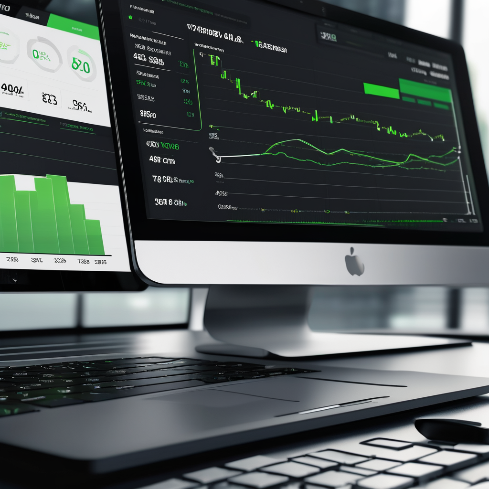
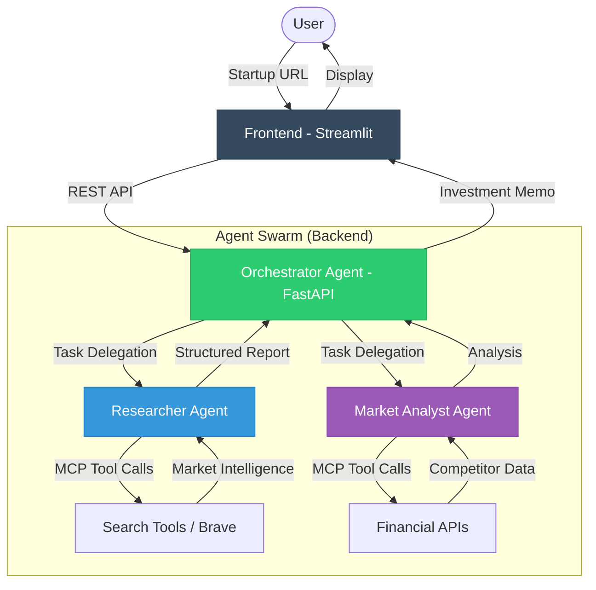

# VC-Agent Pro: Autonomous Due Diligence System



**VC-Agent Pro** is a next-generation AI agent system designed to automate the initial due diligence process for Venture Capital firms. It leverages the **Model Context Protocol (MCP)** for standardized tool access and an **Agent-to-Agent (A2A)** messaging protocol for collaboration.


## 🏗 Architecture

The system operates as a coordinated swarm of specialized agents:

1.  **Orchestrator Agent**: Manages the workflow and synthesizes the final report.
2.  **Researcher Agent**: Uses MCP tools to scour the web for product and technology details.
3.  **Market Analyst Agent**: Uses MCP tools to query proprietary databases for competitor analysis.



## 🚀 Getting Started

### Prerequisites

- Python 3.9+
- OpenAI API Key (Optional, simulated in this demo)

### Installation

1.  Clone the repository:
    ```bash
    git clone https://github.com/USERNAME/vc-agent-pro.git
    cd vc-agent-pro
    ```

2.  Install dependencies:
    ```bash
    pip install -r requirements.txt
    ```

### Running the System

You need to run both the Backend (Agent Brain) and the Frontend (AG-UI).

**Terminal 1: Start the Agent Backend**
```bash
uvicorn backend.main:app --reload
```

**Terminal 2: Launch the AG-UI**
```bash
streamlit run frontend/app.py
```

## 🧠 How it Works (Under the Hood)

1.  **User Input**: You provide a startup URL via the Streamlit UI.
2.  **Orchestration**: The UI sends a request to the FastAPI backend via REST.
3.  **A2A Collaboration**: The Orchestrator spins up a `Researcher` and `MarketAnalyst`. It sends strictly typed `AgentMessage` objects to delegate tasks.
4.  **MCP Execution**: Agents receive tasks and use the `MCPClient` to request data. Use of MCP ensures we can swap "Simulated Search" for "Brave Search" or "Google Search" without changing agent logic.
5.  **Synthesis**: Results flow back to the Orchestrator, which compiles the "Investment Memo" and returns it to the UI.

## 📄 License
MIT
